# Practica 2: Instalación y configuración de DHCP en Debian
`por Bruno González Tresgallo - ASIR2`

En esta actividad vamos a crear una conexión entre maquinas con DHCP, para esto usaremos a PfSense como router, Debian 12.1 como servidor, Windows 10 y Debian 12 como clientes.
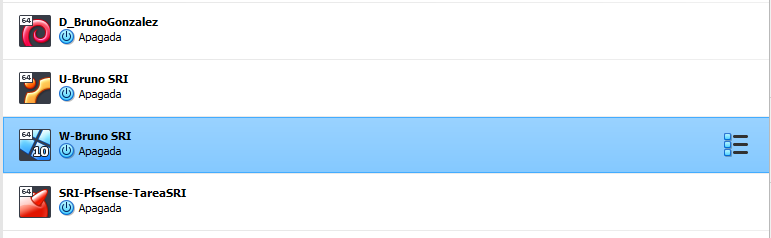

## Ejercicio 1. Configuración del servidor DHCP. 
a) Instala el servidor DHCP en la máquina correspondiente.
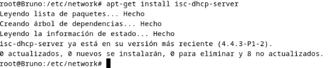

b) Realiza las configuraciones adicionales necesarias para que funcione el servidor DHCP.
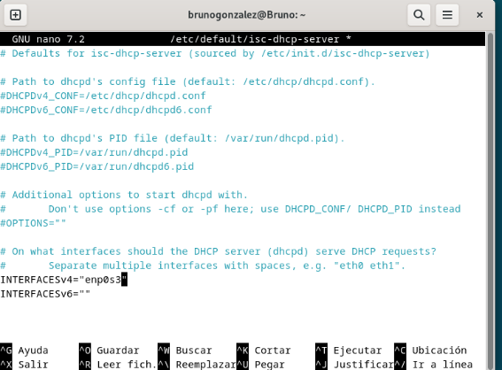

c) Realiza las configuraciones necesarias para cumplir los siguientes requisitos: 
    a. El servidor repartirá direcciones IP en el rango 10.0.XX.1 - 10.0.ΧΧ. 100. 

    b. Utilizará la máscara por defecto correspondiente a esa subred.

    c. Deberá utilizar como puerta de enlace la que corresponda según el diagrama de red.

    d. Como servidor DNS preferido se utilizará el del instituto (deberás averiguarlo) y como alternativo el de google.

    e. Además, se enviará a los clientes el sufijo DNS sriXX.local.

    f. Para el cliente Ubuntu se le reservará la dirección 10.0.XX.60. 

    g. Respecto a los tiempos de alquiler:

    i. El tiempo de alquiler por defecto será de 15 días para todos los equipos. 

    ii. Nunca será superior a 30 días. 

    iii. Nunca será inferior a 1 semana.

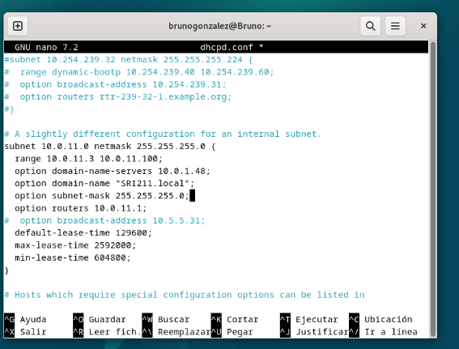

d) Reinicia el servicio y verifica que tras el reinicio está activo y en ejecución.

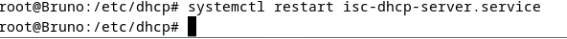

Esta activo y en ejecucion

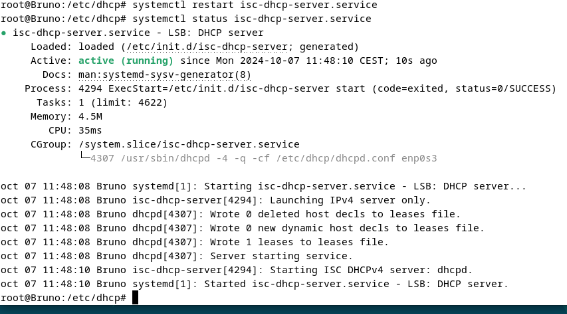

## Ejercicio 2. Configuración de los clientes DHCP. 
a) Configura los equipos Windows y Linux como clientes DHCP.

Windows

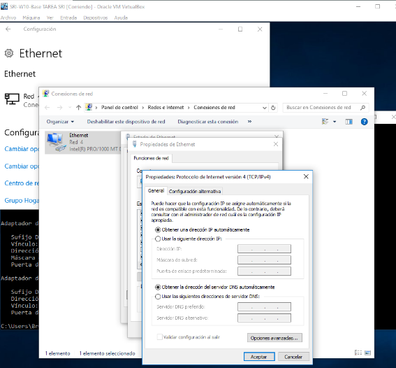

Linux

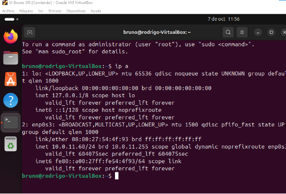

b) Observa dentro del archivo adecuado del servidor si las IPs han sido asignadas.

Windows

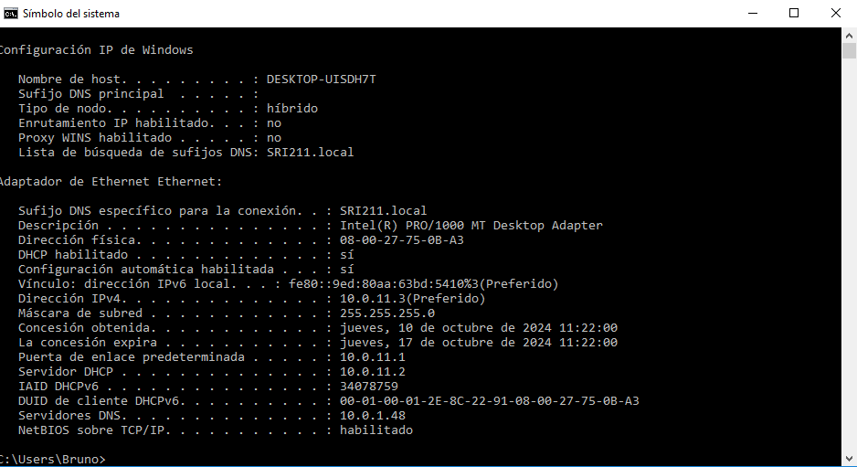

Linux

c) Observa dentro de ambos clientes que son correctos todos los parámetros enviados por el servidor, es decir: 

    i. IP 

    ii. Máscara 

    iii. Puerta de enlace 

    iv. DNS primario 

    v. DNS alternativo 

    i. Nombre de dominio 

    vii. La MAC del equipo que tiene la reserva. 

Linux

 

Windows

d) Verifica que existe conectividad entre los equipos y que además ambos equipos se conectan a Internet.

Windows

 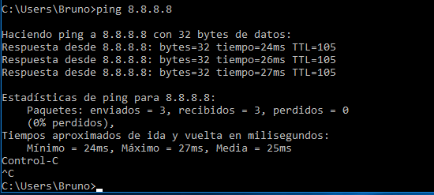

 Ping a linux

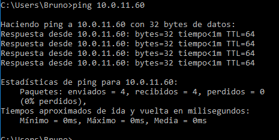

Linux

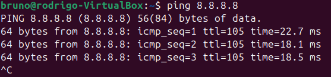

Ping a windows

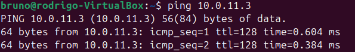

## Ejercicio 3. Funcionamiento del servicio. 

Para terminar, deberás explicar la actividad generada por el servidor isc-dhcp-server que has instalado y configurado y que se ha registrado en los logs del sistema por la herramienta Journalctl.

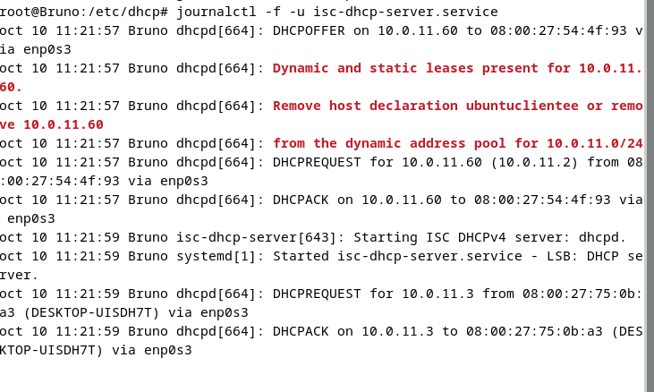

DHCPOFFER:
El servidor DHCP responde al mensaje DHCPDISCOVER ofreciendo una dirección IP al cliente a través de este mensaje.

DHCPREQUEST:
Una vez que el cliente recibe la oferta de IP, envía este mensaje para confirmar su interés en esa dirección IP.

DHCPACK:
El servidor DHCP responde con este mensaje para confirmar que la dirección IP ha sido asignada al cliente y que está lista para ser utilizada.
